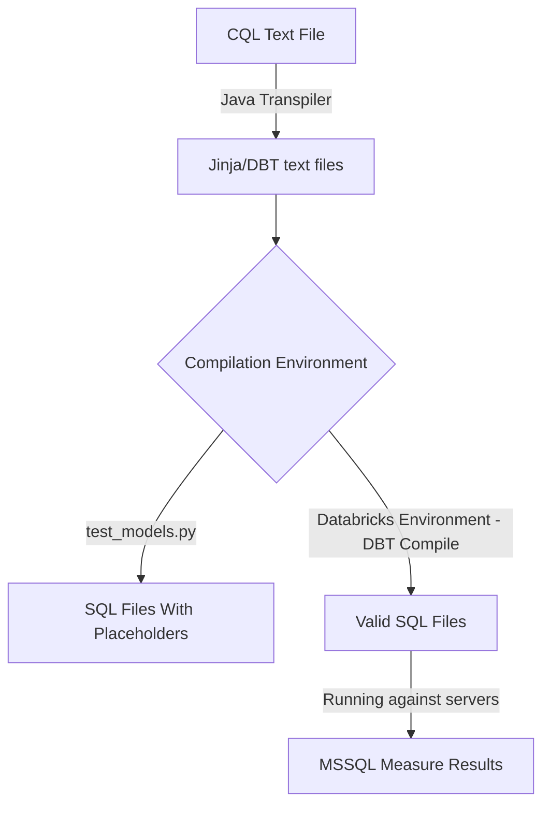
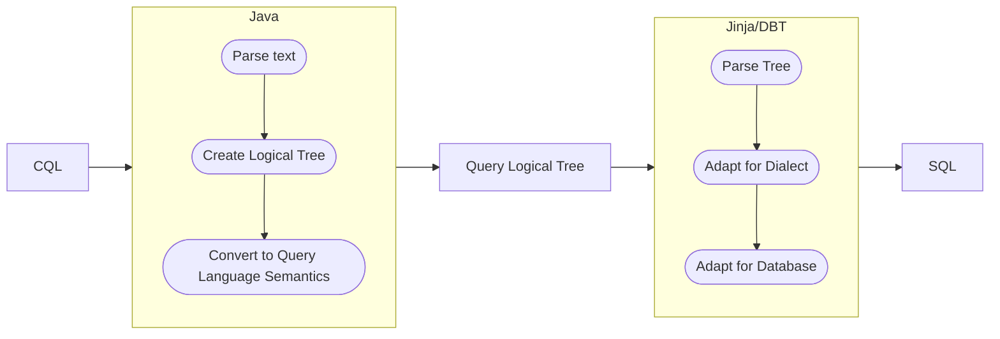
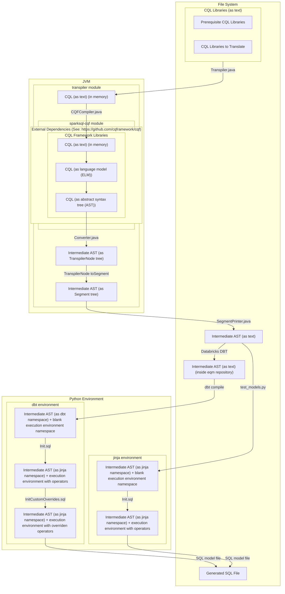
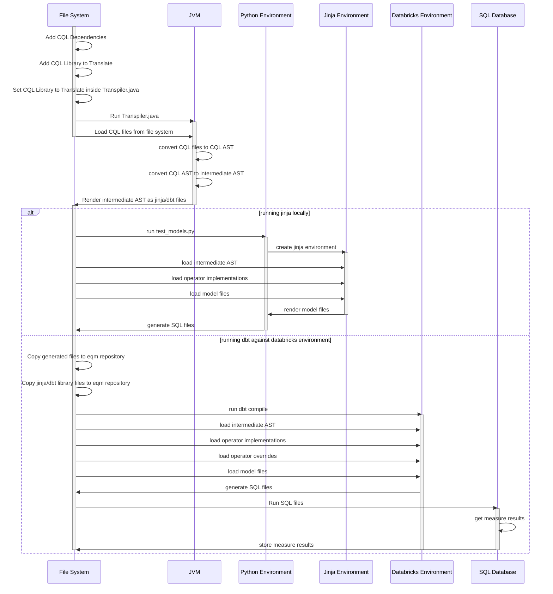

Reading this file requires [mermaid](https://github.com/mermaid-js/mermaid).

# Simplified Overview

# Main Overview

# Measure Logic Transformation Overview

# Sequence Diagram

# Unit Testing Java Code

Unit tests still need to be created for Java.

# Integration Testing Jinja Code

Java code does not need to be integration tested.

# Unit Testing Jinja Code
Run test_operators.py and look at outputs in resources/test_target/operators.

# Integration Testing Jinja Code
Run test_models.py and look at outputs in resources/test_target/models