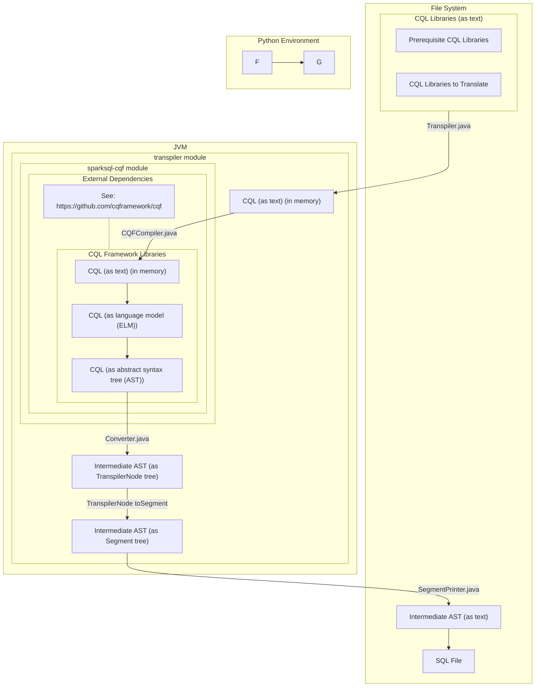

Reading this file requires [mermaid](https://github.com/mermaid-js/mermaid).

# Main Overview
#```mermaid
flowchart TD

A[CQL Text File] -->|Java Transpiler| B[Jinja/DBT text files]
B -->C{Compilation Environment}
C -->|test_models.py| D[SQL Files With Placeholders]
C -->|Databricks Environment - DBT Compile| E[Valid SQL Files]
E -->|Running against servers| F[MSSQL Measure Results]
#```

# Measure Logic Transformation Overview


```mermaid
flowchart TB
    subgraph fs [File System]
        subgraph cql["CQL Libraries (as text)"]
            PrereqCQL["Prerequisite CQL Libraries"]
            CQLToTranslate["CQL Libraries to Translate"]
        end
        JinjaText["Intermediate AST (as text)"]
        SQL["SQL File"]
        JinjaText --> SQL
    end
    subgraph jvm [JVM]
        subgraph transpiler ["transpiler module"]
            subgraph sparksqlcqf ["sparksql-cqf module"]
                subgraph externalDependencies["External Dependencies"]
                    subgraph cqlFramework["CQL Framework Libraries"]
                        libraryWorkA["CQL (as text) (in memory)"]
                        libraryWorkB["CQL (as language model (ELM))"]
                        libraryWorkC["CQL (as abstract syntax tree (AST))"]
                        libraryWorkA --> libraryWorkB --> libraryWorkC
                    end
                    reference["See: https://github.com/cqframework/cqf"]
                    reference .- cqlFramework
                end
            end
            CQLAsTextTranspiler["CQL (as text) (in memory)"]
            CQLAsTextTranspiler -->|"CQFCompiler.java"| libraryWorkA
            IntermediateASTNodes["Intermediate AST (as TranspilerNode tree)"]
            libraryWorkC -->|"Converter.java"| IntermediateASTNodes
            IntermediateASTSegments["Intermediate AST (as Segment tree)"]
            IntermediateASTNodes -->|"TranspilerNode toSegment"| IntermediateASTSegments
            IntermediateASTSegments -->|"SegmentPrinter.java"| JinjaText
        end
    end
    cql -->|"Transpiler.java"| CQLAsTextTranspiler
    subgraph python [Python Environment]
    F --> G
    end
```

        CQLToTranslateJVM["CQL Libraries to translate (as text)"]
        CQLAST["AST CQL Libraries to translate (as tree of nodes)"]
        IntermediateASTNodes["Inter"]
        IntermediateASTTextJVM

-> transpiler module | Transpiler.java
1. CQL as text (in JVM)
-> sparcql-cql module
1. CQL AST as tree of objects (in JVM)
-> transpiler module | Converter.java
1. Intermediate AST as tree of objects (in JVM)
-> transpiler module | TranspilerNode.java toSegment
1. Intermediate AST as tree of text strings (in JVM)
-> transpiler module | SegmentPrinter.java
1. Intermediate AST as text
1. Intermediate AST as text (on filesystem)
-> test_models.py
1. blank environment
-> resources/jinja/library/Init.sql
1. 'environment' namespace populated with operator implementations and helper functions
1. <decision> compilation environment
+ on databricks
-> resources/jinja/custom_overrides/InitCustomOverrides.sql
1. 'environment' namespace populated with database-specific overrides for operator implementations and helper functions
-> return to main line
+ local jinja
-> compile file from resources/jinja/test/models
1. Intermediate AST as tree of objects (as namespace)
-> Execution of operator implementations
? note: with operator implementations set, the intermediate AST is equivalent to a target-language AST
1. Measure as text (in target language)
# Unit Testing Java Code

Unit tests still need to be created for Java.

# Integration Testing Jinja Code

Java code does not need to be integration tested.

# Unit Testing Jinja Code
Run test_operators.py and look at outputs in resources/test_target/operators.

# Integration Testing Jinja Code
Run test_models.py and look at outputs in resources/test_target/models