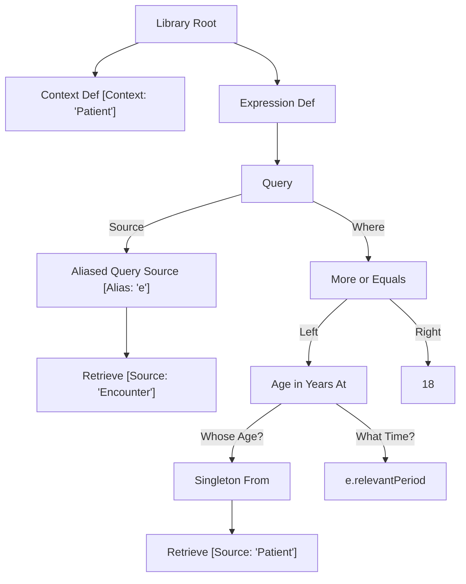

CQL assumes that if you're in a context, e.g. Patient, you're dealing with *one* of those things at a time

Take the following (tiny) CQL Library, adapted from the sub-measure "Encounter with Principal Diagnosis and Age" inside the Jinja TJCOverall library.

```
Context Patient
define "All Encounters With Adults":
    [Encounter] As e
        where AgeInYearsAt(date from start of e.relevantPeriod)>= 18
```

Loosely, this measure can be interpeted to mean, "I want all encounters where the patients involved were at least 18 at the time of admission."

As SQL, that might look something like this:

```
SELECT * FROM Encounters
AS e
WHERE EXISTS
    SELECT * FROM Patient
    AS p
    WHERE e.patientId = p.patientId
    AND DATEDIFF(year, e.relevantPeriod, p.birthDateTime) >= 18
```

But there's a devil in the details-- CQL normally expects you to only be working with a single member of whatever the context is at a time. So in this case, it expects you to have a *single* patient you're interested in. So literally, this measure means, "I want all encounters where *this* patient was 18 or older at the time of admission.

Because of that, the Abstract Syntax Tree (AST) generated from the original CQL ends up looking like this:



... where the "Singleton From" node means that the CQL parser expects you to somehow choose one specific patient in the Patient table to use for this measure.

As SQL, that might look something like this:

```
AELECT * FROM Encounters
AS e
WHERE patientId = @patientId
AND
    SELECT * FROM Patient
    AS p
    WHERE patientId = @patientId
    AND DATEDIFF(year, e.relevantPeriod, p.birthDateTime) >= 18
```
...where @patientId is a parameter supplied to SQL at query execution time.

This is the most direct translation of the generated AST, but our use case is a little different than what CQL was apparently designed for. Because: we want to run this measure for *every* patient within some group-- a cohort or a hospital or similar-- so that then we can calculate measures like "Average Number of Visits Per Adult Patient."

From a developer-time perspective, it would actually be pretty easy to use the literal translation for our purposes. There's an [existing CQL evaluator](https://github.com/cqframework/cql-engine?tab=readme-ov-file) that runs against the HAPI FHIR Server. It seems to only evaluate one patient per measure at a time (or one practitioner, etc.) but we could just run it in a loop over every single patient. If there are no performance concerns for running every measure patient-by-patient, I would recommend stopping work on the transpiler and seeing if we can adapt that paradigm to QDM.

If there *are* performance concerns, however-- and I believe that's the case-- then I need a consistent rule to translate between how the CQL parser wants to interpret the measure libraries, and how we actually want to use the measure libraries in practice.

Options:

1. I can automatically join retrieves to whatever table defines the context, so that in-context information is always available. This would look something like this:

```
SELECT * FROM
    SELECT * FROM Encounters
    AS e
    GROUP BY patientId
    JOIN
    Select * FROM Patients
    AS p
    ON e.patientId = p.patientId
AS e
WHERE DATEDIFF(year, e.relevantPeriod.start, e.birthDateTime) >= 18
```

Drawbacks: Consantly joining tables may cause extremely high memory usage... maybe. I don't know how smart the MSSQL query optimizer is. If the query optimizer ends up reformatting the queries to only retrieve the column data that actually gets used by top-level queries that could be a non-issue.

2. I can track alias definitions to construct an internal state that includes a guess at how to make singletons out of the context table

```
SELECT * FROM
    SELECT * FROM Encounters
    GROUP BY patientId
    AS e
    WHERE
        DATEDIFF(year,
            e.relevantPeriod.start, 
            SELECT birthDate FROM
                SELECT * FROM
                    SELECT * FROM Patients
                AS SingletonFrom
                WHERE e.patientId = p.patientId
        ) >= 18
```
Drawbacks: This solution requires me to make some assumptions about the CQL "SingletonFrom" operator and where it's likely to show up. The decision to use that 'e' in "WHERE e.patientId" is nonobvious from the point-of-view of the transpiler. 

Summarizing the transpiler workflow:

A parser converts the original SQL into an AST. (See: the chart I included earlier in this document.) Then, The transpiler performs a depth-first search of the AST to transform it into SQL. As it transverses nodes, I keep track of a 'state'. For example, if one node defines a variable [A = 1] and another is a variable reference [Ref A] the transpiler will look inside the state and supply the value of A.

It's trivial for the transpiler to use any information direclty available on a node. It's easy for the transpiler to track and supply named variables. It's relatively easy for the transpiler to track and supply information about parents and children of a given node. But supplying information from an separate, anonymous branch of the tree requires making assumptions about how the tree is allowed to be formed-- how CQL is allowed to be written.

I think I can make certain assumptions that allow me to implement this option succesfully, but there's an element of risk to doing things this way-- I might later discover an edge case that forces me to use Option 1 after all.