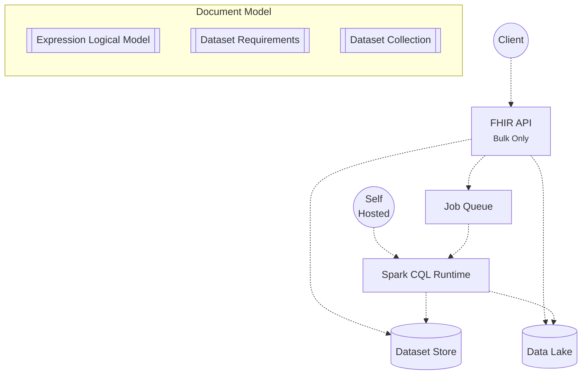
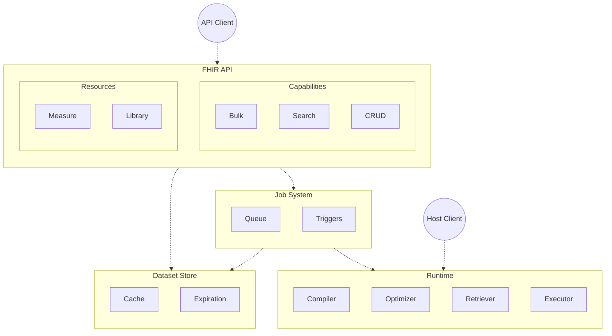

# Package Model

##

```mermaid
graph TB
    client((Client))

    api[FHIR API<br><small>Bulk Only</small>]
    dss[(Dataset Store)]
    lake[(Data Lake)]
    job[Job Queue]
    runtime[Spark CQL Runtime]
    self_hosted_client((Self<br/>Hosted))
    
    client -.-> api 
    self_hosted_client -.-> runtime
    api -.-> job
    api -.-> dss
    api -.-> lake
    job -.-> runtime
    runtime -.-> dss
    runtime -.-> lake

    subgraph doc_model[Document Model]
        direction TB
        elm[[Expression Logical Model]]
        dr[[Dataset Requirements]]
        ds_idx[[Dataset Collection]]
    end
```

##

```mermaid
graph TB
    api_user((API Client))

    subgraph fhir_api[FHIR API]
        direction BT
        subgraph capabilities[Capabilities]
            Bulk
            Search
            CRUD
        end
        subgraph resources[Resources]
            Measure
            Library
        end
    end
    
    subgraph store[Dataset Store]
        direction TB
        Cache
        Expiration
    end

    subgraph job[Job System]
        direction TB
        Queue
        Triggers
    end

    hosted_user((Host Client))

    subgraph runtime[Runtime]
        direction TB
        Compiler
        Optimizer
        Retriever
        Executor
    end

    api_user -.-> fhir_api
    fhir_api -.-> job
    fhir_api -.-> store
    job -.-> store
    job -.-> runtime
    hosted_user -.-> runtime
```