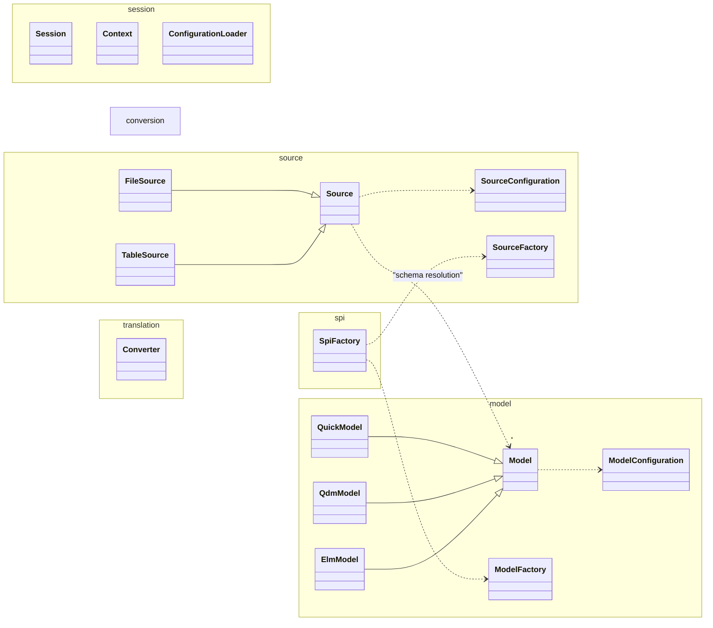

```mermaid
classDiagram
    namespace spi {
        class SpiFactory
    }

    namespace session {
        class Session
        class Context
        class ConfigurationLoader
    }

    namespace conversion {
        class Converter
    }

    namespace source {
        class Source
        class SourceConfiguration
        class SourceFactory
        class FileSource
        class TableSource
    }
    
    namespace model {
        class Model
        class ModelConfiguration
        class ModelFactory
        class QuickModel
        class QdmModel
        class ElmModel
    }
    
    namespace translation {
        class Converter
    }

    Source ..> SourceConfiguration
    Model ..> ModelConfiguration
    
    SpiFactory ..> SourceFactory
    SpiFactory ..> ModelFactory

    Source ..> "*" Model : "schema resolution"

    %% Concrete classes as examples
    QuickModel --|> Model
    QdmModel --|> Model
    ElmModel --|> Model
    
    FileSource --|> Source
    TableSource --|> Source

    direction LR
```

