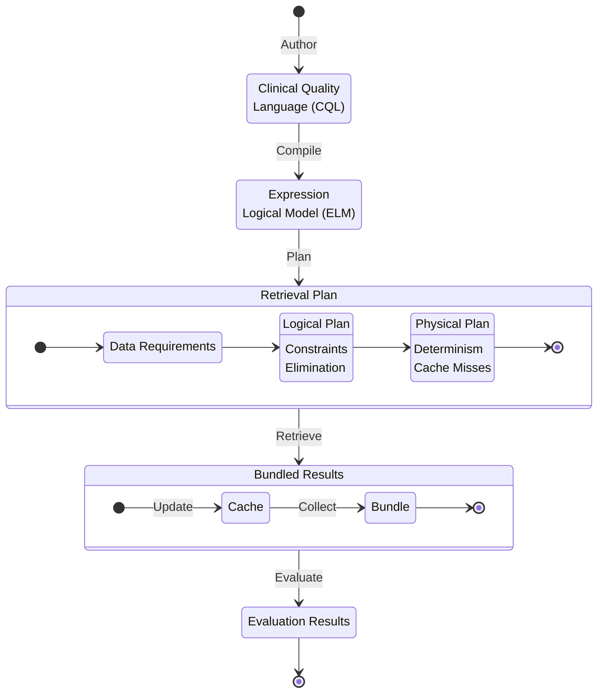
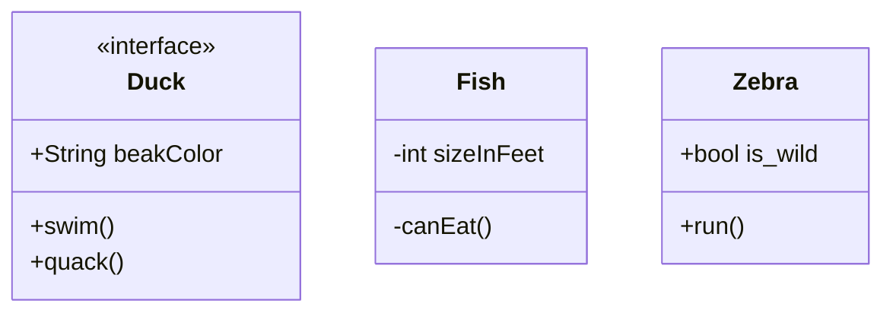
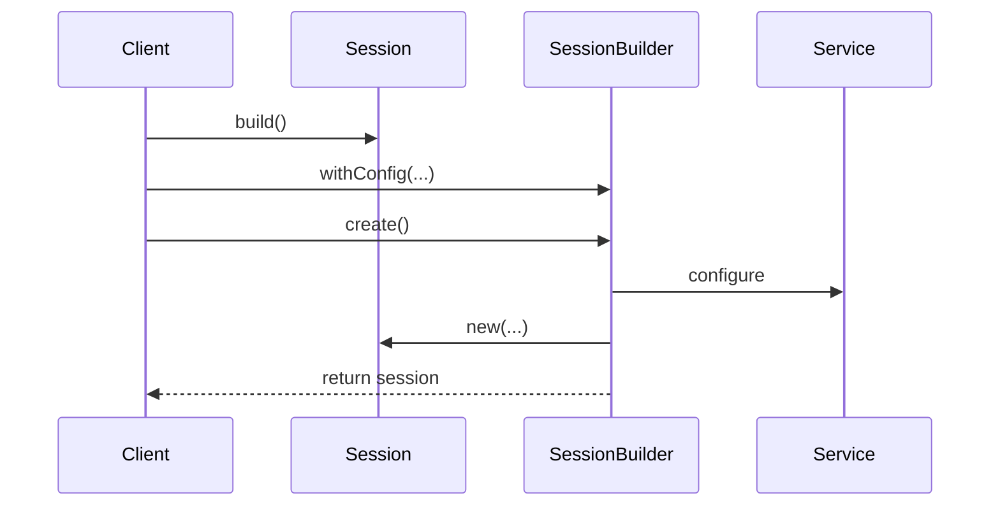
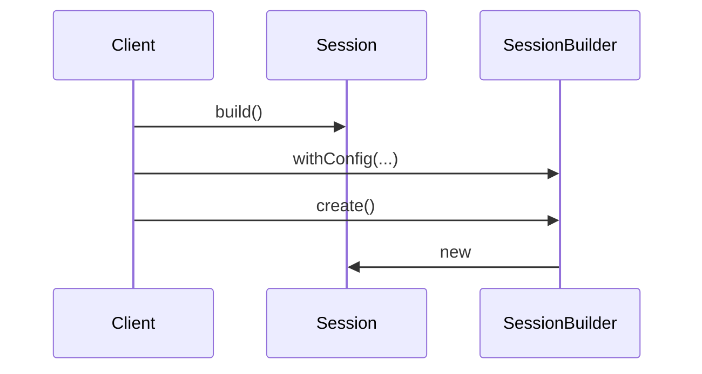

# CQL Service Component

## Workflow
- Compile
- Generate Plans
    - Collect retrieves
    - Optimize plans
- Bulk Retrieve
    - Acquire data
	- Apply retrieval filters
	- Group by Context (ContextID, List of RetrieveOps: List )
	- Join by Context
- MapPartitions 
- Evaluate
- Output

## Model Transitions

CQL Authoring to Evaluation...

## Class Design

## Use Case Sequencing
### UC2.1 - Configuration

### UC2.1.1 - Configure Deployment

### UC2.1.2 - Configure Session

### UC2.2 - Process Measures

TODO
- Consider UC correlation
- Incremental (subpopulation) calculations only performed during bundling operations. Too many joins and overhead for doing this for all retrieves. SparkCQL is optimized for full population analysis.