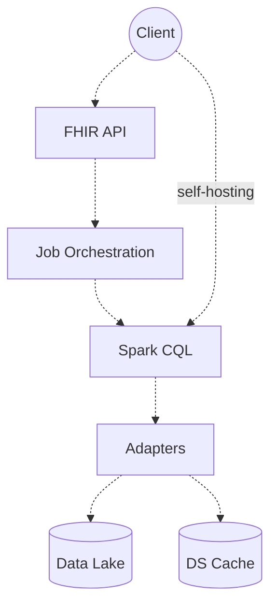

# System Design

## Use Cases

- **UC1 - Configure Environment**
- **UC2 - Calculate Measures**

## Context

- **FHIR API**: 
- **Job Orchestration**: 
- **SparkCQL Engine**: 
- **Adapters**: 
- **Data Lake**: 
- **Cache Store**: 

### Dependency Graph

